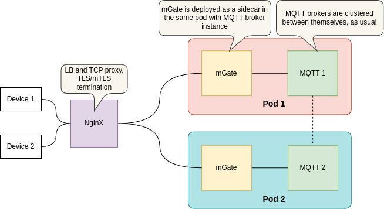

# mGate

![Go Report Card][grc]
[![License][LIC-BADGE]][LIC]


mGate is a lightweight, scalable, and customizable IoT API gateway designed to support seamless communication across multiple protocols. It enables real-time packet manipulation, features pluggable authentication mechanisms, and offers observability for monitoring and troubleshooting. Built for flexibility, mGate can be deployed as a sidecar or standalone service and can also function as a library for easy integration into applications.

The extensible nature of mGate allows developers to customize it to fit various IoT ecosystems, ensuring optimal performance and security.

## Key Features

Some of the key features of mGate include multi-protocol support, real-time packet manipulation, pluggable authentication, observability, and scalability, all while being lightweight, customizable, and easily deployable as a sidecar or standalone service. 
<p align="center"></p>

#### Multi-Protocol Support
mGate is built to interface with a wide range of IoT protocols, including:
- MQTT
- CoAP
- HTTP
- WebSocket
- Easily extendable to support additional protocols.

### On-the-Fly Packet Manipulation
Allows real-time packet transformation and processing.
Custom logic or package interceptors can be injected for modifying incoming and outgoing messages.

### Authentication and Authorization
Pluggable authentication system supporting different providers like OAuth, JWT, API Keys, and more.
Access Control for fine-grained resource authorization.
Easily replaceable auth modules for integration with custom or enterprise identity systems.

### Observability
Provides real-time metrics for monitoring system health and performance.
Offers logging and tracing to facilitate troubleshooting and optimization and options to easily integrate with Prometheus, Grafana, and OpenTelemetry for detailed tracing and visualization.

### Scalable Architecture
mGate is designed to scale horizontally, ensuring it can handle high-throughput environments.

### Pluggable and Extensible
Core components are modular, making it easy to plug in custom modules or replace existing ones.
Extendable to add new IoT protocols, middleware, and features as needed.

### Customizable
Highly configurable, allowing adjustment of protocol-specific behaviors, observability, and performance optimizations.
Minimal configuration is required for default deployment but supports deep customization.

### Lightweight
Built with Go programming language, it's optimized for low resource usage, making it suitable for both high-performance data centers and resource-constrained IoT edge devices.

### Deployment Flexibility
Can be deployed as a sidecar to enhance existing microservices or as a standalone service for direct IoT device interaction.
Available as a library for integration into existing applications.

## Usage

```bash
git clone https://github.com/absmach/mgate.git
cd mgate
make
./build/mgate
```

## Architecture

mGate starts protocol servers, offering connections to devices. Upon the connection, it establishes a session with a remote protocol server. It then pipes packets from devices to the protocol server, inspecting or modifying them as they flow through the proxy.

Here is the flow in more detail:

- The Device connects to mGate's server
- mGate accepts the inbound (IN) connection and establishes a new session with the remote server (e.g. it dials out to the MQTT broker only once it accepts a new connection from a device. This way one device-mGate connection corresponds to one mGate-MQTT broker connection.)
- mGate then spawns 2 goroutines: one that will read incoming packets from the device-mGate socket (INBOUND or UPLINK), inspect them (calling event handlers) and write them to mGate-server socket (forwarding them towards the server) and other that will be reading server responses from mGate-server socket and writing them towards device, in device-mGate socket (OUTBOUND or DOWNLINK).

<p align="center"></p>

mGate can parse and understand protocol packages, and upon their detection, it calls external event handlers. Event handlers should implement the following interface defined in [pkg/mqtt/events.go](pkg/mqtt/events.go):

```go
// Handler is an interface for mGate hooks
type Handler interface {
    // Authorization on client `CONNECT`
    // Each of the params are passed by reference, so that it can be changed
    AuthConnect(ctx context.Context) error

    // Authorization on client `PUBLISH`
    // Topic is passed by reference, so that it can be modified
    AuthPublish(ctx context.Context, topic *string, payload *[]byte) error

    // Authorization on client `SUBSCRIBE`
    // Topics are passed by reference, so that they can be modified
    AuthSubscribe(ctx context.Context, topics *[]string) error

    // After client successfully connected
    Connect(ctx context.Context)

    // After client successfully published
    Publish(ctx context.Context, topic *string, payload *[]byte)

    // After client successfully subscribed
    Subscribe(ctx context.Context, topics *[]string)

    // After client unsubscribed
    Unsubscribe(ctx context.Context, topics *[]string)

    // Disconnect on connection with client lost
    Disconnect(ctx context.Context)
}
```
The Handler interface is inspired by MQTT protocol control packets; if the underlying protocol does not support some of these actions, the implementation can simply omit them. An example of implementation is given [here](examples/simple/simple.go), alongside with it's [`main()` function](cmd/main.go).

## Deployment

To explain the deployment process, an MQTT broker will be used as an example, given that MQTT is one of the most widely used and feature-rich protocols. mGate does not do load balancing - just pure and simple proxying with TLS termination. This is why it should be deployed right in front of its corresponding MQTT broker instance: one mGate for each MQTT broker instance in the MQTT cluster.

Usually, this is done by deploying mGate as a side-car in the same Kubernetes pod alongside with MQTT broker instance (MQTT cluster node).

<p align="center"></p>

LB tasks can be offloaded to a standard ingress proxy - for example, NginX.

## Example Setup & Testing of mGate

### Requirements

- Golang
- Mosquitto MQTT Server
- Mosquitto Publisher and Subscriber Client

### Example Setup of mGate

mGate is used to proxy requests to a backend server. For the example setup, we will use Mosquitto server as the backend for MQTT, and MQTT over Websocket and an HTTP echo server for HTTP.

1. Start the Mosquitto MQTT Server with the following command. This bash script will initiate the Mosquitto MQTT server with WebSocket support. The Mosquitto Server will listen for MQTT connections on port 1883 and MQTT over WebSocket connections on port 8000.

   ```bash
   examples/server/mosquitto/server.sh
   ```

2. Start the HTTP Echo Server:

   ```bash
   go run examples/server/http-echo/main.go
   ```

3. Start the OCSP/CRL Mock responder:

   ```bash
    go run examples/ocsp-crl-responder/main.go
   ```

4. Start the example mGate servers for various protocols:

   ```bash
   go run cmd/main.go
   ```

   The `cmd/main.go` Go program initializes mGate servers for the following protocols:

   - mGate server for `MQTT` protocol `without TLS` on port `1884`
   - mGate server for `MQTT` protocol `with TLS` on port `8883`
   - mGate server for `MQTT` protocol `with mTLS` on port `8884`
   - mGate server for `MQTT over WebSocket without TLS` on port `8083`
   - mGate server for `MQTT over WebSocket with TLS` on port `8084`
   - mGate server for `MQTT over WebSocket with mTLS` on port `8085` with prefix path `/mqtt`
   - mGate server for `HTTP protocol without TLS` on port `8086` with prefix path `/messages`
   - mGate server for `HTTP protocol with TLS` on port `8087` with prefix path `/messages`
   - mGate server for `HTTP protocol with mTLS` on port `8088` with prefix path `/messages`

### Example testing of mGate

#### Test mGate server for MQTT protocols

Bash scripts available in `examples/client/mqtt` directory help to test the mGate servers running for MQTT protocols

- Script to test mGate server running at port 1884 for MQTT without TLS

  ```bash
  examples/client/mqtt/without_tls.sh
  ```

- Script to test mGate server running at port 8883 for MQTT with TLS

  ```bash
  examples/client/mqtt/with_tls.sh
  ```

- Script to test mGate server running at port 8884 for MQTT with mTLS

  ```bash
  examples/client/mqtt/with_mtls.sh
  ```

#### Test mGate server for MQTT over WebSocket protocols

Go programs available in `examples/client/websocket/*/main.go` directory helps to test the mGate servers running for MQTT over WebSocket protocols

- Go program to test mGate server running at port 8083 for MQTT over WebSocket without TLS

  ```bash
  go run examples/client/websocket/without_tls/main.go
  ```

- Go program to test mGate server running at port 8084 for MQTT over WebSocket with TLS

  ```bash
  go run examples/client/websocket/with_tls/main.go
  ```

- Go program to test mGate server running at port 8085 for MQTT over Websocket with mTLS

  ```bash
  go run examples/client/websocket/with_mtls/main.go
  ```

#### Test mGate server for HTTP protocols

Bash scripts available in `examples/client/http` directory help to test the mGate servers running for HTTP protocols

- Script to test mGate server running at port 8086 for HTTP without TLS

  ```bash
  examples/client/http/without_tls.sh
  ```

- Script to test mGate server running at port 8087 for HTTP with TLS

  ```bash
  examples/client/http/with_tls.sh
  ```

- Script to test mGate server running at port 8088 for HTTP with mTLS

  ```bash
  examples/client/http/with_mtls.sh
  ```

## Configuration

The service is configured using the environment variables presented in the following table. Note that any unset variables will be replaced with their default values.

| Variable                                           | Description                                                                                                                           | Default                      |
| -------------------------------------------------- | ------------------------------------------------------------------------------------------------------------------------------------- | ---------------------------- |
| MGATE_MQTT_WITHOUT_TLS_ADDRESS                    | MQTT without TLS inbound (IN) connection listening address                                                                            | :1884                        |
| MGATE_MQTT_WITHOUT_TLS_TARGET                     | MQTT without TLS outbound (OUT) connection address                                                                                    | localhost:1883               |
| MGATE_MQTT_WITH_TLS_ADDRESS                       | MQTT with TLS inbound (IN) connection listening address                                                                               | :8883                        |
| MGATE_MQTT_WITH_TLS_TARGET                        | MQTT with TLS outbound (OUT) connection address                                                                                       | localhost:1883               |
| MGATE_MQTT_WITH_TLS_CERT_FILE                     | MQTT with TLS certificate file path                                                                                                   | ssl/certs/server.crt         |
| MGATE_MQTT_WITH_TLS_KEY_FILE                      | MQTT with TLS key file path                                                                                                           | ssl/certs/server.key         |
| MGATE_MQTT_WITH_TLS_SERVER_CA_FILE                | MQTT with TLS server CA file path                                                                                                     | ssl/certs/ca.crt             |
| MGATE_MQTT_WITH_MTLS_ADDRESS                      | MQTT with mTLS inbound (IN) connection listening address                                                                              | :8884                        |
| MGATE_MQTT_WITH_MTLS_TARGET                       | MQTT with mTLS outbound (OUT) connection address                                                                                      | localhost:1883               |
| MGATE_MQTT_WITH_MTLS_CERT_FILE                    | MQTT with mTLS certificate file path                                                                                                  | ssl/certs/server.crt         |
| MGATE_MQTT_WITH_MTLS_KEY_FILE                     | MQTT with mTLS key file path                                                                                                          | ssl/certs/server.key         |
| MGATE_MQTT_WITH_MTLS_SERVER_CA_FILE               | MQTT with mTLS server CA file path                                                                                                    | ssl/certs/ca.crt             |
| MGATE_MQTT_WITH_MTLS_CLIENT_CA_FILE               | MQTT with mTLS client CA file path                                                                                                    | ssl/certs/ca.crt             |
| MGATE_MQTT_WITH_MTLS_CERT_VERIFICATION_METHODS    | MQTT with mTLS certificate verification methods, if no value or unset then mGate server will not do client validation                | ocsp                         |
| MGATE_MQTT_WITH_MTLS_OCSP_RESPONDER_URL           | MQTT with mTLS OCSP responder URL, it is used if OCSP responder URL is not available in client certificate AIA                        | <http://localhost:8080/ocsp> |
| MGATE_MQTT_WS_WITHOUT_TLS_ADDRESS                 | MQTT over Websocket without TLS inbound (IN) connection listening address                                                             | :8083                        |
| MGATE_MQTT_WS_WITHOUT_TLS_TARGET                  | MQTT over Websocket without TLS outbound (OUT) connection address                                                                     | ws://localhost:8000/         |
| MGATE_MQTT_WS_WITH_TLS_ADDRESS                    | MQTT over Websocket with TLS inbound (IN) connection listening address                                                                | :8084                        |
| MGATE_MQTT_WS_WITH_TLS_TARGET                     | MQTT over Websocket with TLS outbound (OUT) connection address                                                                        | ws://localhost:8000/         |
| MGATE_MQTT_WS_WITH_TLS_CERT_FILE                  | MQTT over Websocket with TLS certificate file path                                                                                    | ssl/certs/server.crt         |
| MGATE_MQTT_WS_WITH_TLS_KEY_FILE                   | MQTT over Websocket with TLS key file path                                                                                            | ssl/certs/server.key         |
| MGATE_MQTT_WS_WITH_TLS_SERVER_CA_FILE             | MQTT over Websocket with TLS server CA file path                                                                                      | ssl/certs/ca.crt             |
| MGATE_MQTT_WS_WITH_MTLS_ADDRESS                   | MQTT over Websocket with mTLS inbound (IN) connection listening address                                                               | :8085                        |
| MGATE_MQTT_WS_WITH_MTLS_PATH_PREFIX               | MQTT over Websocket with mTLS inbound (IN) connection path                                                                            | /mqtt                        |
| MGATE_MQTT_WS_WITH_MTLS_TARGET                    | MQTT over Websocket with mTLS outbound (OUT) connection address                                                                       | ws://localhost:8000/         |
| MGATE_MQTT_WS_WITH_MTLS_CERT_FILE                 | MQTT over Websocket with mTLS certificate file path                                                                                   | ssl/certs/server.crt         |
| MGATE_MQTT_WS_WITH_MTLS_KEY_FILE                  | MQTT over Websocket with mTLS key file path                                                                                           | ssl/certs/server.key         |
| MGATE_MQTT_WS_WITH_MTLS_SERVER_CA_FILE            | MQTT over Websocket with mTLS server CA file path                                                                                     | ssl/certs/ca.crt             |
| MGATE_MQTT_WS_WITH_MTLS_CLIENT_CA_FILE            | MQTT over Websocket with mTLS client CA file path                                                                                     | ssl/certs/ca.crt             |
| MGATE_MQTT_WS_WITH_MTLS_CERT_VERIFICATION_METHODS | MQTT over Websocket with mTLS certificate verification methods, if no value or unset then mGate server will not do client validation | ocsp                         |
| MGATE_MQTT_WS_WITH_MTLS_OCSP_RESPONDER_URL        | MQTT over Websocket with mTLS OCSP responder URL, it is used if OCSP responder URL is not available in client certificate AIA         | <http://localhost:8080/ocsp> |
| MGATE_HTTP_WITHOUT_TLS_ADDRESS                    | HTTP without TLS inbound (IN) connection listening address                                                                            | :8086                        |
| MGATE_HTTP_WITHOUT_TLS_PATH_PREFIX                | HTTP without TLS inbound (IN) connection path                                                                                         | /messages                    |
| MGATE_HTTP_WITHOUT_TLS_TARGET                     | HTTP without TLS outbound (OUT) connection address                                                                                    | <http://localhost:8888/>     |
| MGATE_HTTP_WITH_TLS_ADDRESS                       | HTTP with TLS inbound (IN) connection listening address                                                                               | :8087                        |
| MGATE_HTTP_WITH_TLS_PATH_PREFIX                   | HTTP with TLS inbound (IN) connection path                                                                                            | /messages                    |
| MGATE_HTTP_WITH_TLS_TARGET                        | HTTP with TLS outbound (OUT) connection address                                                                                       | <http://localhost:8888/>     |
| MGATE_HTTP_WITH_TLS_CERT_FILE                     | HTTP with TLS certificate file path                                                                                                   | ssl/certs/server.crt         |
| MGATE_HTTP_WITH_TLS_KEY_FILE                      | HTTP with TLS key file path                                                                                                           | ssl/certs/server.key         |
| MGATE_HTTP_WITH_TLS_SERVER_CA_FILE                | HTTP with TLS server CA file path                                                                                                     | ssl/certs/ca.crt             |
| MGATE_HTTP_WITH_MTLS_ADDRESS                      | HTTP with mTLS inbound (IN) connection listening address                                                                              | :8088                        |
| MGATE_HTTP_WITH_MTLS_PATH_PREFIX                  | HTTP with mTLS inbound (IN) connection path                                                                                           | /messages                    |
| MGATE_HTTP_WITH_MTLS_TARGET                       | HTTP with mTLS outbound (OUT) connection address                                                                                      | <http://localhost:8888/>     |
| MGATE_HTTP_WITH_MTLS_CERT_FILE                    | HTTP with mTLS certificate file path                                                                                                  | ssl/certs/server.crt         |
| MGATE_HTTP_WITH_MTLS_KEY_FILE                     | HTTP with mTLS key file path                                                                                                          | ssl/certs/server.key         |
| MGATE_HTTP_WITH_MTLS_SERVER_CA_FILE               | HTTP with mTLS server CA file path                                                                                                    | ssl/certs/ca.crt             |
| MGATE_HTTP_WITH_MTLS_CLIENT_CA_FILE               | HTTP with mTLS client CA file path                                                                                                    | ssl/certs/ca.crt             |
| MGATE_HTTP_WITH_MTLS_CERT_VERIFICATION_METHODS    | HTTP with mTLS certificate verification methods, if no value or unset then mGate server will not do client validation                | ocsp                         |
| MGATE_HTTP_WITH_MTLS_OCSP_RESPONDER_URL           | HTTP with mTLS OCSP responder URL, it is used if OCSP responder URL is not available in client certificate AIA                        | <http://localhost:8080/ocsp> |

## mGate Configuration Environment Variables

### Server Configuration Environment Variables

- `ADDRESS` : Specifies the address at which mGate will listen. Supports MQTT, MQTT over WebSocket, and HTTP proxy connections.
- `PATH_PREFIX` : Defines the path prefix when listening for MQTT over WebSocket or HTTP connections.
- `TARGET` : Specifies the address of the target server, including any prefix path if available. The target server can be an MQTT server, MQTT over WebSocket, or an HTTP server.

### TLS Configuration Environment Variables

- `CERT_FILE` : Path to the TLS certificate file.
- `KEY_FILE` : Path to the TLS certificate key file.
- `SERVER_CA_FILE` : Path to the Server CA certificate file.
- `CLIENT_CA_FILE` : Path to the Client CA certificate file.
- `CERT_VERIFICATION_METHODS` : Methods for validating certificates. Accepted values are `ocsp` or `crl`.
  For the `ocsp` value, the `tls.Config` attempts to retrieve the OCSP responder/server URL from the Authority Information Access (AIA) section of the client certificate. If the client certificate lacks an OCSP responder URL or if an alternative URL is preferred, you can override it using the environmental variable `OCSP_RESPONDER_URL`.  
  For the `crl` value, the `tls.Config` attempts to obtain the Certificate Revocation List (CRL) file from the CRL Distribution Point section in the client certificate. If the client certificate lacks a CRL distribution point section, or if you prefer to override it, you can use the environmental variables `CRL_DISTRIBUTION_POINTS` and `CRL_DISTRIBUTION_POINTS_ISSUER_CERT_FILE`. If no CRL distribution point server is available, you can specify an offline CRL file using the environmental variables `OFFLINE_CRL_FILE` and `OFFLINE_CRL_ISSUER_CERT_FILE`.

#### OCSP Configuration Environment Variables

- `OCSP_DEPTH` : Depth of client certificate verification in the OCSP method. The default value is 0, meaning there is no limit, and all certificates are verified.
- `OCSP_RESPONDER_URL` : Override value for the OCSP responder URL present in the Authority Information Access (AIA) section of the client certificate. If left empty, it expects the OCSP responder URL from the AIA section of the client certificate.

#### CRL Configuration Environment Variables

- `CRL_DEPTH`: Depth of client certificate verification in the CRL method. The default value is 1, meaning only the leaf certificate is verified.
- `CRL_DISTRIBUTION_POINTS` : Override for the CRL Distribution Point value present in the certificate's CRL Distribution Point section.
- `CRL_DISTRIBUTION_POINTS_ISSUER_CERT_FILE` : Path to the issuer certificate file for verifying the CRL retrieved from `CRL_DISTRIBUTION_POINTS`.
- `OFFLINE_CRL_FILE` : Path to the offline CRL file, which can be used if the CRL Distribution point is not available in either the environmental variable or the certificate's CRL Distribution Point section.
- `OFFLINE_CRL_ISSUER_CERT_FILE` : Location of the issuer certificate file for verifying the offline CRL file specified in `OFFLINE_CRL_FILE`.

## Adding Prefix to Environmental Variables

mGate relies on the [caarlos0/env](https://github.com/caarlos0/env) package to load environmental variables into its [configuration](https://github.com/arvindh123/mgate/blob/main/config.go#L15).
You can control how these variables are loaded by passing `env.Options` to the `config.EnvParse` function.

To add a prefix to environmental variables, use `env.Options{Prefix: "MGATE_"}` from the [caarlos0/env](https://github.com/caarlos0/env) package. For example:

```go
package main
import (
  "github.com/caarlos0/env/v11"
  "github.com/absmach/mgate"
)

mqttConfig := mgate.Config{}
if err := mqttConfig.EnvParse(env.Options{Prefix:  "MGATE_" }); err != nil {
    panic(err)
}
fmt.Printf("%+v\n")
```

In the above snippet, `mqttConfig.EnvParse` expects all environmental variables with the prefix `MGATE_`.
For instance:

- MGATE_ADDRESS
- MGATE_PATH_PREFIX
- MGATE_TARGET
- MGATE_CERT_FILE
- MGATE_KEY_FILE
- MGATE_SERVER_CA_FILE
- MGATE_CLIENT_CA_FILE
- MGATE_CERT_VERIFICATION_METHODS
- MGATE_OCSP_DEPTH
- MGATE_OCSP_RESPONDER_URL
- MGATE_CRL_DEPTH
- MGATE_CRL_DISTRIBUTION_POINTS
- MGATE_CRL_DISTRIBUTION_POINTS_ISSUER_CERT_FILE
- MGATE_OFFLINE_CRL_FILE
- MGATE_OFFLINE_CRL_ISSUER_CERT_FILE

## License

[Apache-2.0](LICENSE)

[grc]: https://goreportcard.com/badge/github.com/absmach/mgate
[LIC]: LICENCE
[LIC-BADGE]: https://img.shields.io/badge/License-Apache_2.0-blue.svg
